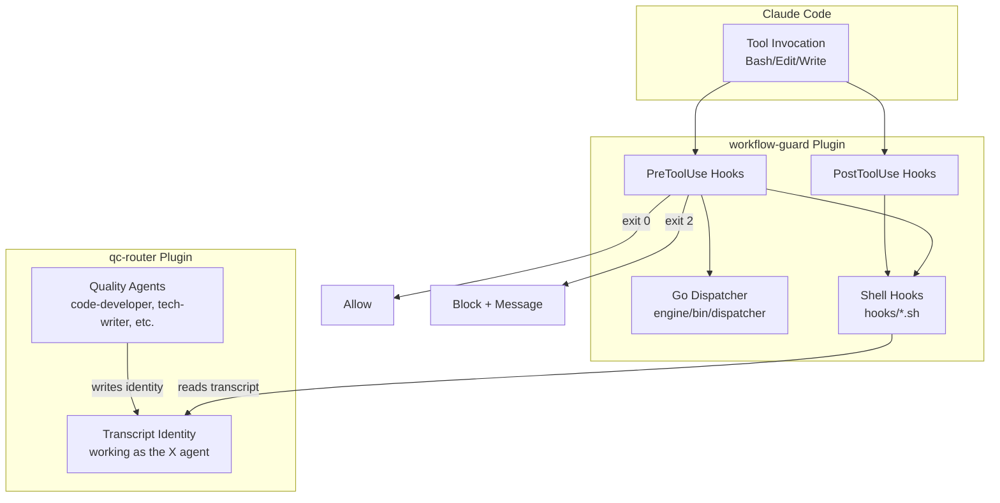

# ARCHITECTURE.md

Architecture overview for workflow-guard Claude Code plugin.

## Overview

workflow-guard provides two enforcement capabilities:

1. **Git workflow protection** - Blocks commits to protected branches, enforces PR workflow
2. **Quality context enforcement** - Blocks file edits without agent context from qc-router

## System Architecture



## Core Components

| Component | Purpose |
|-----------|---------|
| `hooks/hooks.json` | Declarative hook configuration (matcher, timeout, command) |
| `engine/bin/dispatcher` | Go binary for YAML rule evaluation (~1ms startup) |
| `hooks/*.sh` | Shell scripts for complex enforcement logic |
| `scripts/*.sh` | Ticket lifecycle: activate, complete, cleanup |
| `commands/*.md` | 7 handoff/workflow slash commands |

## Agent vs Hook Distinction

| System | Provides | Role |
|--------|----------|------|
| **workflow-guard** | Hooks (enforcement) | Blocks/allows tool invocations |
| **qc-router** | Agents (quality work) | Performs Creator/Critic/Expediter work |

## Quality Context Detection

`block-unreviewed-edits.sh` reads `transcript.jsonl` to detect agent identity:

```
Pattern: "working as the {agent-name} agent"
Agents: code-developer, code-reviewer, code-tester,
        plugin-engineer, plugin-reviewer, plugin-tester,
        tech-writer, tech-editor, tech-publisher
```

## Directory Structure

```
workflow-guard/
├── hooks/
│   ├── hooks.json              # Hook configuration
│   ├── block-main-commits.sh   # Git protection
│   ├── block-unreviewed-edits.sh  # Quality gate
│   └── ...
├── engine/                     # Go dispatcher
├── scripts/                    # Ticket lifecycle
└── commands/                   # Slash commands
```

See [DEVELOPER.md](DEVELOPER.md) for implementation details.
